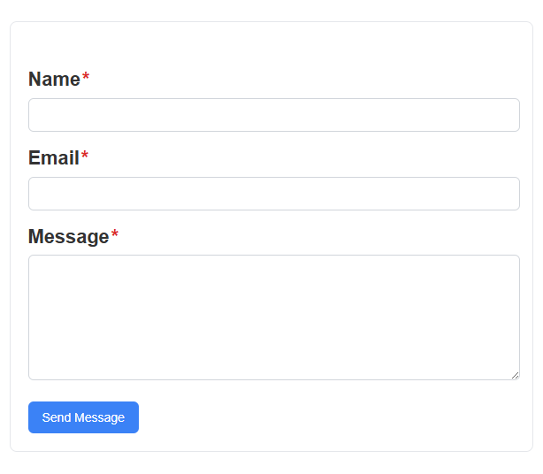
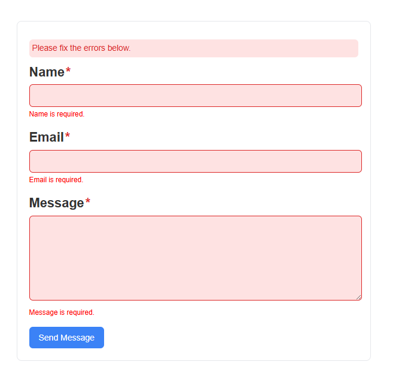
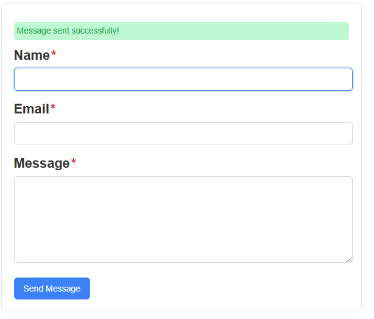
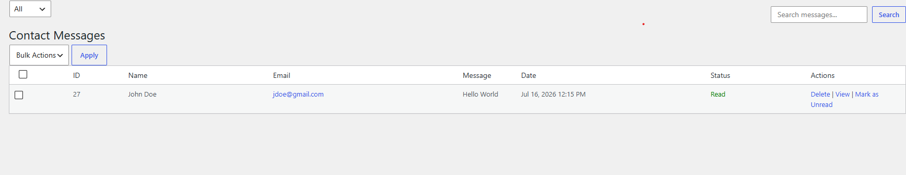
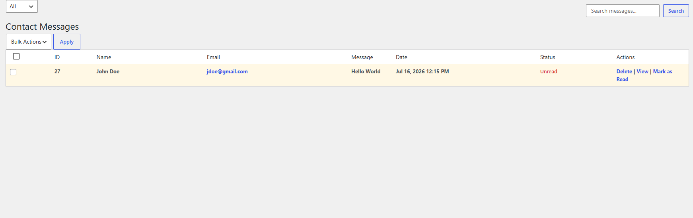

# LAGS Contact Lite

A lightweight, developer-friendly contact form plugin for WordPress.
Built for simplicity, speed, and clean integration—without unnecessary bloat.

---

## ✨ Overview

**LAGS Contact Lite** provides a fast and minimal way to add a contact form to any WordPress site.
It focuses on performance and usability, making it ideal for developers and site owners who want full control without relying on heavy third-party plugins.

---

## 🚀 Features

- ⚡ **AJAX Submission** — Send messages without page reloads
- ✅ **Field Validation** — Basic validation for required fields
- 🧾 **Admin Message Management** — View and manage submissions in the dashboard
- 🎨 **Clean UI** — Minimal, distraction-free design
- 🧩 **Shortcode Support** — Easily embed the form anywhere

---

## 📸 Screenshots

### Frontend Form



### Validation Example




### Admin Dashboard Messages




---

## 📦 Installation

1. Upload the plugin to:

   ```
   /wp-content/plugins/lags-contact-lite
   ```

2. Activate the plugin from the WordPress dashboard
3. Add the shortcode to any page or post:

   ```
   [lags_contact_lite]
   ```

---

## 🛠 Usage

Once activated, simply place the shortcode in your content and the form will render automatically.

You can customize styling through your theme or extend functionality as needed.

---

## 📁 Project Structure

```
lags-contact-lite/
├── assets/
├── includes/
├── partials/
├── lags-contact-lite.php
```

---

## 🎯 Goals

- Keep things **lightweight and fast**
- Provide a **simple alternative** to bulky form plugins
- Maintain **clean and readable code** for developers

---

## 👤 Author

**LAGS**
Self-taught developer focused on building practical and lightweight tools.

---

## 📄 License

This project is open-source and available under the MIT License.
